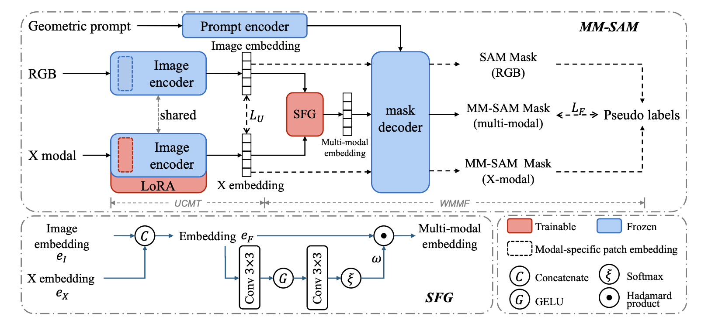

<h1 align="center">Segment Anything with Multiple Modalities
</h1>
<p align="center">

<a href="https://arxiv.org/abs/2408.09085" target='_blank'>
    
  </a><h5 align="center">
    <em>
        <a href="https://scholar.google.com/citations?user=yGKsEpAAAAAJ&hl=en">Aoran Xiao*</a>,
        <a href="https://scholar.google.com/citations?user=7e0W-2AAAAAJ&hl=en">Weihao Xuan*</a>,
        <a href="https://scholar.google.co.jp/citations?user=CH-rTXsAAAAJ&hl=en">Heli Qi</a>,
        <a href="https://scholar.google.co.jp/citations?user=uOAYTXoAAAAJ&hl=en">Yun Xing</a>,
        <a href="https://scholar.google.co.jp/citations?user=DJ2KOn8AAAAJ&hl=ja">Naoto Yokoya^</a>,
        <a href="https://scholar.google.com/citations?user=uYmK-A0AAAAJ&hl=en">Shijian Lu^</a> 
       <br>(* indicates co-first authors with equal contributions. ^ indicates the corresponding authors.)
    </em>
</h5><p align="center">

## About
Robust and accurate segmentation of scenes has become one core functionality in various visual recognition and navigation tasks. This has inspired the recent development of Segment Anything Model (SAM), a foundation model for general mask segmentation. However, SAM is largely tailored for single-modal RGB images, limiting its applicability to multi-modal data captured with widely-adopted sensor suites, such as LiDAR plus RGB, depth plus RGB, thermal plus RGB, etc. We develop MM-SAM, an extension and expansion of SAM that supports cross-modal and multi-modal processing for robust and enhanced segmentation with different sensor suites. MM-SAM features two key designs, namely, unsupervised cross-modal transfer and weakly-supervised multi-modal fusion, enabling label-efficient and parameter-efficient adaptation toward various sensor modalities. It addresses three main challenges: 1) adaptation toward diverse non-RGB sensors for single-modal processing, 2) synergistic processing of multi-modal data via sensor fusion, and 3) mask-free training for different downstream tasks. Extensive experiments show that MM-SAM consistently outperforms SAM by large margins, demonstrating its effectiveness and robustness across various sensors and data modalities.

## News
- **(2024/8)** Code will be available soon!

## Method



## Citation

If you find this work helpful, please kindly consider citing our paper:

```bibtex
@article{mmsam,
  title={Segment Anything with Multiple Modalities}, 
  author={Aoran Xiao and Weihao Xuan and Heli Qi and Yun Xing and Naoto Yokoya and Shijian Lu},
  journal={arXiv preprint arXiv:2408.09085},
  year={2024}
}
```


## Acknowledgement
We acknowledge the use of the following public resources throughout this work: [Segment Anything Model](https://github.com/facebookresearch/segment-anything), and [LoRA](https://github.com/microsoft/LoRA).

## Related Projects
Find our other projects for visual foundation models!

[CAT-SAM: Conditional Tuning for Few-Shot Adaptation of Segment Anything Model](https://github.com/weihao1115/cat-sam), ECCV 2024, Oral Paper.

## Related Projects
Find our other projects for visual foundation models!

[CAT-SAM: Conditional Tuning for Few-Shot Adaptation of Segment Anything Model](https://github.com/weihao1115/cat-sam), ECCV 2024, Oral Paper.
